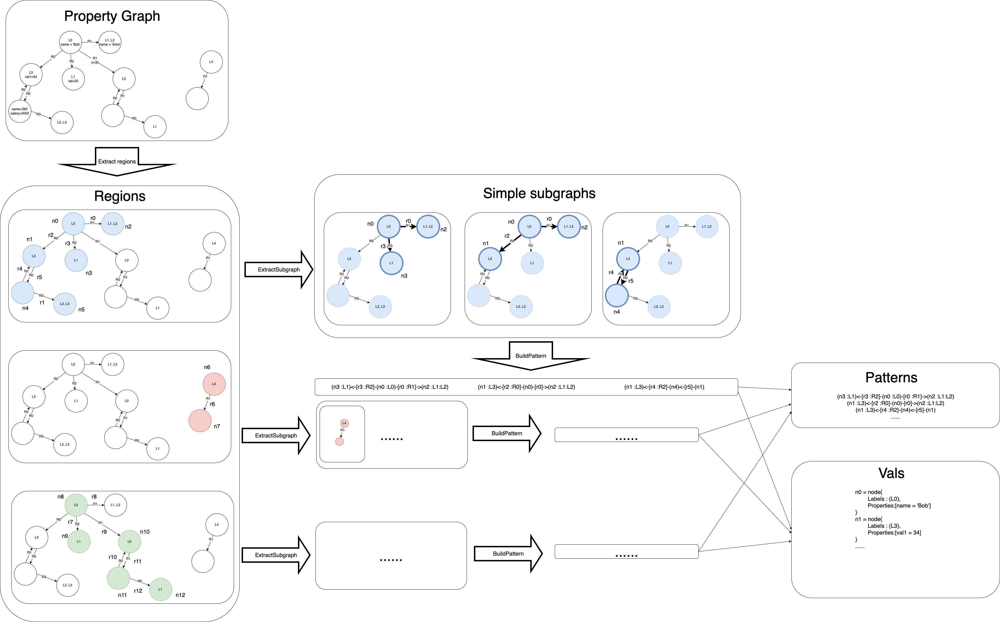
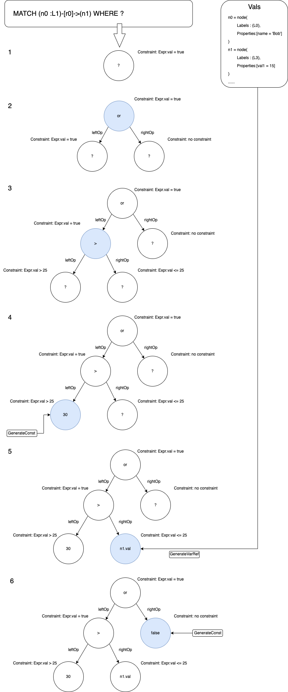

# GDsmith

We propose GDsmith, to the best of our knowledge the first black-box approach for testing graph database engines.

# Getting Started

Requirements:
* Java 11
* [Maven](https://maven.apache.org/)
* The graph database engines that you want to test (now supporting Neo4j, RedisGraph, and Memgraph)


# Project Structure

* src
    * main/java/org.example.gdsmith
        * common:  infrastructure
        * cypher
          * ast/standard_ast: implementation of ast structure
          * algorithm: algorithms for GDsmith
            * Compared3AlgorithmNew.java: the original algorithm used by GDsmith
            * Compared1AlgorithmNew.java: the algorithm used by the baseline1
            * Compared2AlgorithmNew.java: the algorithm used by the baseline2
          * gen: generators for queries, graphs, patterns, expressions
            * condition
              * GuidedConditionGenerator.java: the condition generator for GDsmith
              * RandomConditionGenerator.java: the condition generator for baseline1 and baseline2
            * graph
              * SlidingGraphGenerator.java: the graph generator for GDsmith, baseline1 and baseline2 (baseline1 uses two generators to remove guidance strategy, see Compared1AlgorithmNew.java)
            * expr
              * NonEmptyExpressionGenerator.java: the expression generator for GDsmith
              * RandomExpressionGenerator.java: the expression generator for baseline1 and baseline2
          * oracle: oracles
            * DifferentialNonEmptyBranchOracle.java: the differential oracle used by GDsmith, baseline1 and baseline2
        * support for different databases[neo4j, redisGraph, memgraph, ...]
* out: the executable jar file GDsmith.jar
* NewExperiment: the experiment results.
    * compare123.ipynb: get the version-distinct number of discrepancies
    * compare123.svg: the result of compare123.ipynb


# Quick Start
In this section we are going to do differential testing on MemGraph and RedisGraph.
Run the docker images of MemGraph and RedisGraph:

```shell
docker run -d -p 7687:7687 -p 7444:7444 memgraph/memgraph:2.4.0 --query-execution-timeout-sec=1
docker run -d -e REDISGRAPH_ARGS=\"TIMEOUT=1000\" -p 6379:6379 -it --rm redislabs/redisgraph:2.8.20
```

Create the file config.json and paste the following content:
```json
{
  "memgraph@2.4.0": {
    "port": 7687,
    "host": "localhost",
    "username": "neo4j",
    "password": "sqlancer",
    "restart-command": "docker run -d -p 7687:7687 -p 7444:7444 memgraph/memgraph:2.4.0 --query-execution-timeout-sec=1"
  },
  "redisgraph@2.8.17": {
    "port": 6379,
    "host": "localhost",
    "username": "neo4j",
    "password": "sqlancer",
    "restart-command": "docker run -d -e REDISGRAPH_ARGS=\"TIMEOUT=1000\" -p 6379:6379 -it --rm redislabs/redisgraph:2.8.20"
  }
}
```
Then run the following command:
```shell
java -jar GDsmith.jar --algorithm compared3 --num-tries 100 --num-queries 1000 composite
```
The testing should begin, GDsmith will generate 100 graphs and for each graph it will generate 1000 queries.
All the failures found will be recorded in ```logs``` directory.


# Using GDsmith

Generally GDsmith can be configured and executed using the following command:

```bash
java -jar GDsmith.jar [database] --[database_option1] --[database_option2] ...
```

Here are some examples of database options:

```
--algorithm <algorithm-name> // the algorithm for testing
--num-tries <num-tries> // the number of graphs to generate
--num-queries <num-queries> // the number of queries generated for each graph
```

For example, if you want to test Neo4j and use the crash oracle, you can use:

```bash
java -jar GDsmith.jar neo4j --port 7687 --username xxx --password ### --oracle RANDOM_CRASH
```

For the ```composite``` database, as each database may use a different set of configurations, the configuraion for each database is specified in the ```config.json``` file:
```json
{
  "neo4j@4.4.13": {
    "port": 7687,
    "host": "localhost",
    "username": "neo4j",
    "password": "sqlancer"
  },
  "neo4j@4.4.12": {
    "port": 10101,
    "host": "localhost",
    "username": "neo4j",
    "password": "sqlancer"
  }
}
```
GDsmith identify the name of the database by the key in the json file before the "@" character. For example "neo4j@4.4.12" tells neo4j to connect to a datbase using the Neo4j driver. So you can add multiple databases of the same database and name them freely as long as the database name before "@" is corresponded with the actual database:
```json
{
  "neo4j@latest": {
    "port": 7687,
    "host": "localhost",
    "username": "neo4j",
    "password": "sqlancer"
  },
  "neo4j@optimization": {
    "port": 10101,
    "host": "localhost",
    "username": "neo4j",
    "password": "sqlancer"
  },
  "redisgraph@2.8.17": {
    "port": 6379,
    "host": "localhost",
    "username": "neo4j",
    "password": "sqlancer",
    "restart-command": "docker run -d -e REDISGRAPH_ARGS=\"TIMEOUT=1000\" -p 6379:6379 -it --rm redislabs/redisgraph:2.8.20"
  }
}
```

Notice that GDsmith will not automatically create database user, as a result, you might need to manually create a user and grant it with the privilege for remote connection, executing queries, writing to databases and creating/deleting new databases.


Here are the set of databases supported by GDsmith:

```
neo4j
redisgraph
memgraph
compposite  \\ a special abstract database that represents multiple database instances used for differential tesing
```


# Example of Pattern Generation

Here we present an example in the following figure. 

We first extract extract several self-connected subgraphs (regions) from the property graph (the first step in the example). In the example we extract 3 regions.Note that the region can have overlapping parts (see the blue region and the green region in the example). 

Then, for each region, we extract several simple graphs from them to build patterns. The reason for this step is that we cannot simply use one Cypher pattern to represent a region since there are too many nodes and relationships in a region and the Cypher pattern only accept the linear representation form (such as :(n1)-[r1]->(n2)<-[r2]->...). So what we need to do is to extract smaller subgraphs from the region that is able to be represented by patterns. In the example, we extract 3 simple subgraphs from the blue region using the function ExtractSubgraph. Note that the simple subgraphs can have overlapping parts. In fact, we want them to have overlapping parts because the patterns generated from them can represent bigger connected structures rather than disconnected irrelevant small subgraphs.

Finally, each simple subgraph is mapped to a pattern. During the mapping process, we ensure that for the simple subgraphs in the same region, each node or relationship is always mapped to the same unique node variable or relationship variable, as shown in the example (n0-n12, r0-r12 in the regions). We also ensure that the mapped node or relationship variables in different regions have no overlapping variable names to ensure that they will be regarded as irrelevant parts (in the example, even though the blue region and the green region share two overlapping nodes, these two nodes are mapped to n0, n3 and n8, n9 separately). The labels or nodes in the graph are selectively mapped to label constraints (which means sometimes even if n0 has the label L0, we don't add the constraint in the pattern) in the pattern to increase the diversity of patterns. In our example, the three simple subgraphs are mapped to ```(n3 :L1)<-[r3 :R2]-(n0 :L0)-[r0 :R1]->(n2 :L1:L2)```, ```(n1 :L3)<-[r2 :R0]-(n0)-[r0]->(n2 :L1:L2)``` and ```(n1 :L3)<-[r4 :R2]-(n4)<-[r5]-(n1)```.

After the above mapping, we can ensure that ```(n3 :L1)<-[r3 :R2]-(n0 :L0)-[r0 :R1]->(n2 :L1:L2)```, ```(n1 :L3)<-[r2 :R0]-(n0)-[r0]->(n2 :L1:L2)``` and ```(n1 :L3)<-[r4 :R2]-(n4)<-[r5]-(n1)``` can at least match the corresponding nodes in the blue region. These patterns can be used in the query. Of course, sometimes these patterns may also match other subgraphs in the property graph. All we want is to ensure that for all the patterns we generated, at least one set of nodes in the property graph can be matched.

Another important thing for pattern generation is that we will record the value of node and relationship variables in the table Vals. Specifically, we record the labels and property values of each of them. The Vals table will be used for condition generation. Here we only record the values based on our mapping from the property graph to the patterns. In other words, even if ```(n3 :L1)<-[r3 :R2]-(n0 :L0)-[r0 :R1]->(n2 :L1:L2)``` is able to match more than one subgraph in the property graph, we only consider the values of nodes and relationships in the simple subgraph which the pattern is built from.



# Example of Condition Generation

Our general purpose is that at least one row of in the intermediate results can lead to a "true" value of the condition in the WHERE clause. To achieve this, we use a top-down generation process and a top-down set of constraints. The following figure gives an example.

The first thing to notice is that we have prior knowledge of the graph according to the Vals table. This table tells us that, there is one set of nodes that can match the pattern (n0 :L1)-[r0]->(n1) and the property value of n0 is "name = 'Bob'" while the property value of n1 is "val1 = 15"... . 

Now we begin to generate our condition. in the first step, we know that we need to generate an expression which returns true and it should be a boolean expression. We first need to choose an expression that returns a boolean expression. Our options include "and", "or", " >",  "<" and other expressions. In our example the generator choose the "or" expression.

Now for the second step, we have chosen the "or" expression. The expression need to boolean sub-expressions, so what we need to do is to generate them and ensure that the "or" expression to have the "true" value. We do this by splitting the constraint into sub-constraints and pass them to the sub-expression generation logic. The "or" expression require at least one sub-expression to be "true" to get the "true" result. So one way to split the constraint is to let the left sub-expression to have "true" result and let the right sub-expression to have any result.

The above process goes on until we fill all sub-expressions. Sometimes, the completion of an expression require other elements rather than sub-expressions. For example, for the ConstVal expression, it requires a const value. In the fourth step in our example. We need to fill a ConstVal expression. Our constraint is that the const value should be higher than 25 so we randomly generate 30 for it. In the fifth step, we need to fill a GetProperty expressions and ensure that its value is lower than or equal to 25. We search in the Vals table and find that n1.val1 is 15 which satisfies the constraint so we use n1 and its property val1 to fill the expression.

One additional thing to notice is that to simplify the explanation, we claim that each constraint is splitter right before the sub-expression is generated. In the real code, to increase the diversity of sub-expressions, we use a lazy splitting strategy. For example, for a "or" expression which is required to be "true". We first use the constraint Expr.val = any to generate the leftOp expression. Then we calculate the value of the generated expression. If the value is "true", the rightOp can have any value. Otherwise, the rightOp shoud have the constraint to be "true". This is especially helpful for the generation of 



# Bugs Found by GDsmith

The following table shows the number of bugs detected by GDsmith.

| Subject    | Crash bug | Wrong result bug | Fixed | Confirmed but not fixed | Reported but not confirmed |
| ---------- | --------- | ---------------- | ----- | ----------------------- | -------------------------- |
| Neo4j      | 5         | 2                | 7     | 0                       | 0                          |
| RedisGraph | 3         | 11               | 5     | 8                       | 1                          |
| MemGraph   | 0         | 7                | 1     | 2                       | 4                          |
| SUM        | 8         | 20               | 13    | 10                      | 5                          |


# Case Study of Bugs

**Neo4j: wrong execution plan**

```
#Create graph:
CREATE (n0 :L0{k2:-338112306, k4:true});
CREATE (n1 :L3{k24:''});
CREATE (n2 :L2{k17:'YP'});
CREATE (n3 :L4{k26:909121655, k30:'PHLUcE'});
CREATE (n4 :L4);
CREATE (n5 :L3{k23:true});
CREATE (n6 :L4{k27:true, k29:909121655});
CREATE (n7 :L5);
CREATE (n8 :L2);
CREATE (n9 :L4{k26:-246760203, k30:''});
CREATE (n10 :L5{k32:false});
CREATE (n11 :L5{k34:'lFbv3iSE', k35:909121655});
CREATE (n12 :L3{k18:'', k21:'ap3zA', k23:true});
CREATE (n13 :L4{k25:'qzoq', k27:true, k29:-1599697040, k30:'W'});
CREATE (n14 :L3{k23:true});
CREATE (n15 :L1);
CREATE (n16 :L3);
CREATE (n17 :L5);

# Querying:
MATCH (n0) OPTIONAL MATCH (n3) WITH n3 WITH DISTINCT * OPTIONAL MATCH (n3), (n5) OPTIONAL MATCH (n3) RETURN 1;
```

This query get wrong results in Neo4j-4.2.14. Specifically, the result get additional duplicated rows than it should have.

After investigation on the execution plan, the developers found that the execution plan is flawed and an unnecessary CartesianProduct plan is added. This make the ``` OPTIONAL MATCH (n3), (n5) ``` wrongly multiplies n3 with n5 for an additional time and results in more rows in the result.

This bug is caused by the wrong play of ```OPTIONAL MATCH``` along with the disjoint pattern expression ```(n3), (n5)```. It is also a runtime bug as the runtime fails to correct the rows properly.


**RedisGraph: crash of the database system and redis**

```
#Create graph:
CREATE (n0 :L2{id :5})<-[r0 :T2{id :6}]-(n1:L2{id :7})-[r1 :T5{id :8}]->(n2:L5{id :9});
MATCH (n0 { id: 9}) MERGE (n0)<-[r1 :T6{id :116}]-(n1 :L3{id :117});

# Querying:
MATCH (n5 :L3 :L4) OPTIONAL MATCH (n5 :L3)-[r5 :T1]->(n7 :L3), (n8 :L2)<-[r6 :T2]-(n9 :L3 :L5 :L2) RETURN 1;
```

This bug causes the database system along with redis runtime to crash. It leads to a fault during the execution of instructions and might be related to bad memory use. 


**RedisGraph: wrong optimization on labels**

```
#Create graph:
CREATE (n0 :L1)-[r1 :T0]->(n2)<-[r3 :T1]-(n4 :L2), (n2)<-[r4 :T2]-(n5 :L2)

# Querying:
MATCH (n0 :L2 :L1) RETURN * 
```

The above query should return empty results, as no node created have both L1 and L2 label. However, RedisGraph wrongly matches the node with L1 (which is the n0 created in the CREATE clause).

The CREATE query above can create the correct graph. And interestingly, if any of the the above n4 or n5 or the label of n0, n4, n5 is deleted in the CREATE query, the error would not be reproduced. It seems that RedisGraph puzzled when faced with multiple nodes with one having L1 and two having L2. At the same time, the irrelevant n2 is also necessary to reproduce the bug, meaning that the cause lies deep in the pass of the engine and cannot be simply reasoned.

This bug is now fixed and it turns out that the problem lies in the optimization of label scanning.

Although this minimized query and graph is rather small and even should get empty result, the original graph and query are much complicated and get non-empty results. This indicates that GDsmith is able to find bugs triggered by a query at the border between the non-empty-result space and the empty-result space. The minimized graph and query are small and relatively simple, but the condition (especially the structure of the graph) to trigger the bug is still exacting. This again reveals the importance of complex inputs which can result in execution of atypical paths.


**RedisGraph: inconsistency with the Cypher standard**

```
#Create graph:
CREATE (n0 {id: 1})<-[r :T0{id: 2}]-(n1 {id: 3});

# Querying:
MATCH (n6)<-[r4]-(n7)-[r5]->(n8) WHERE (r4.id > -1 AND r5.id > -1) RETURN *;
```

According to the Cypher standard, two relationships in the same pattern with different names should not be matched to the same relationship in the graph. So the above query should return empty result since the the graph contains only one relationship. However, RedisGraph wrongly matches r4 and r5 to the same relationship for twice and get the wrong result to return one row.

The interesting thing is that this bug should be quite easy to be triggered and it is not discovered until RedisGraph-2.8.17. The bug happens in all pattern matching phases with no other pre-conditions so this should be a wrong implementation of the standard.


